# Online-Compiler
<b>An Online coding and MCQ test platform</b>   
Pattern: 
Coding problems can be set along with multiple edge test cases.  
MCQ questions along with 4 options. 
Both in required in the form of MS-Excel Spreadsheets. 
 
Overall scores from multiple users can be downloaded and stored as a handy Excel spreadsheet.
 
 
 
<b><h2>Screenshots</h2></b>
 
 
<b>1. Login Page</b>  

 
 
<b>2. Navigation Screen</b> 
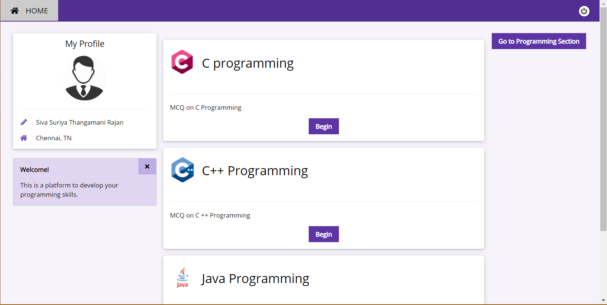
 
 
<b>3. MCQ Intermediate</b> 
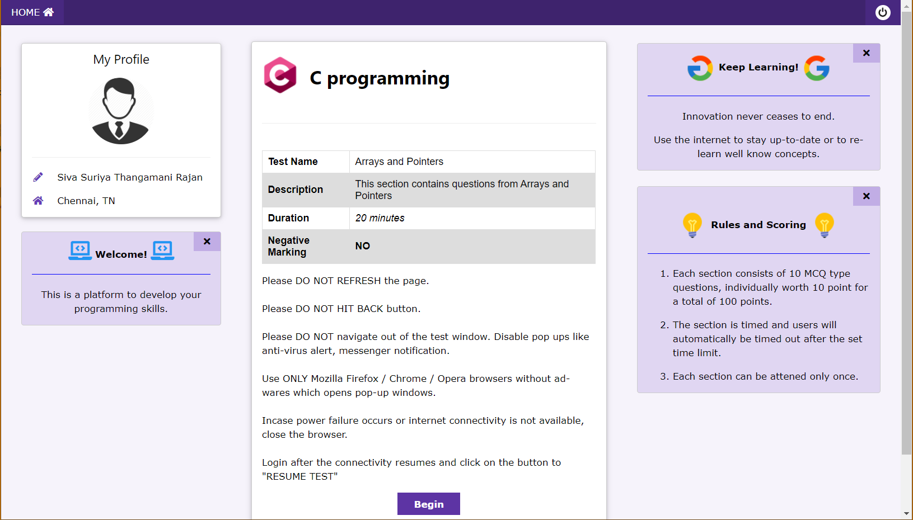
 
 
<b>4. MCQ Question Format</b> 
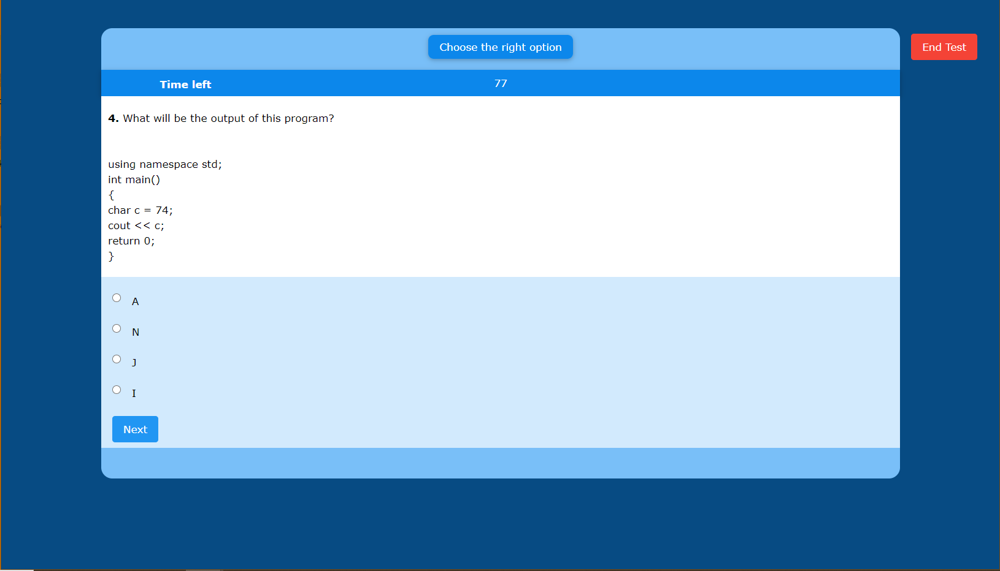
 
 
<b>5. Coding Intermediate</b> 
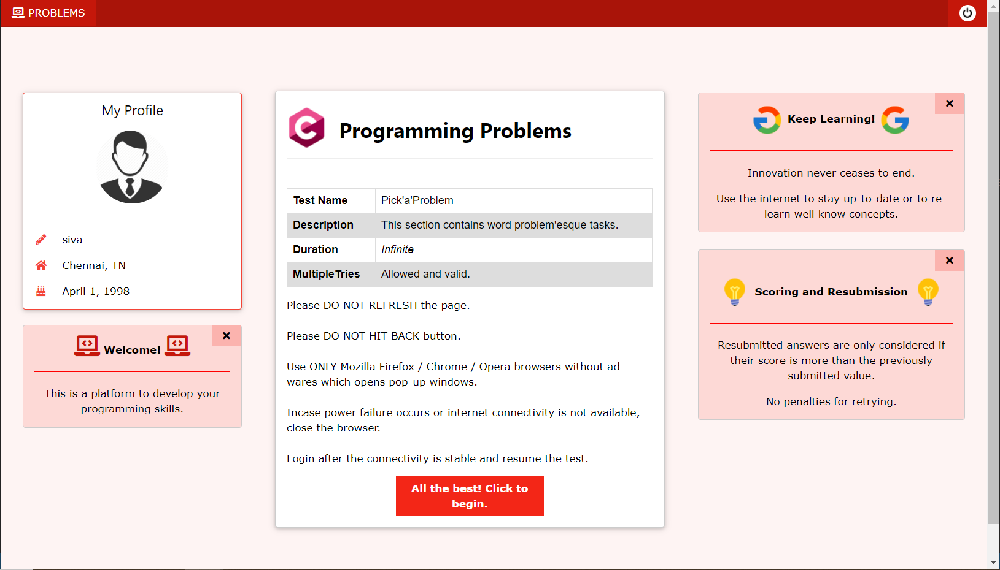
 
 
<b>6. Coding Interface(s)</b> 
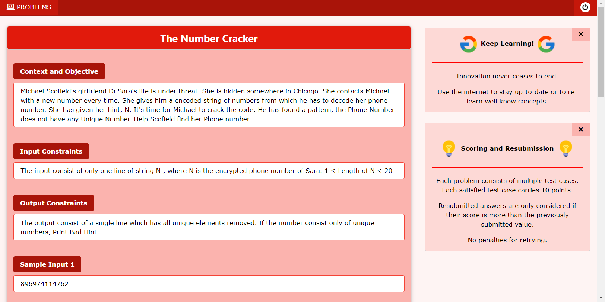
 
   
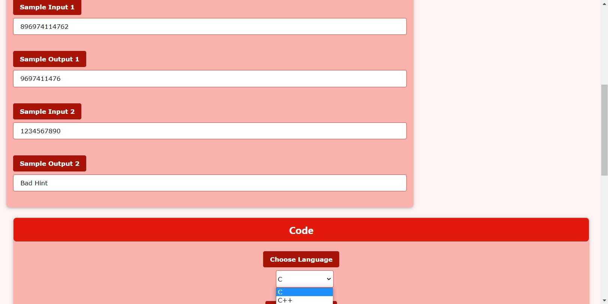
 
 
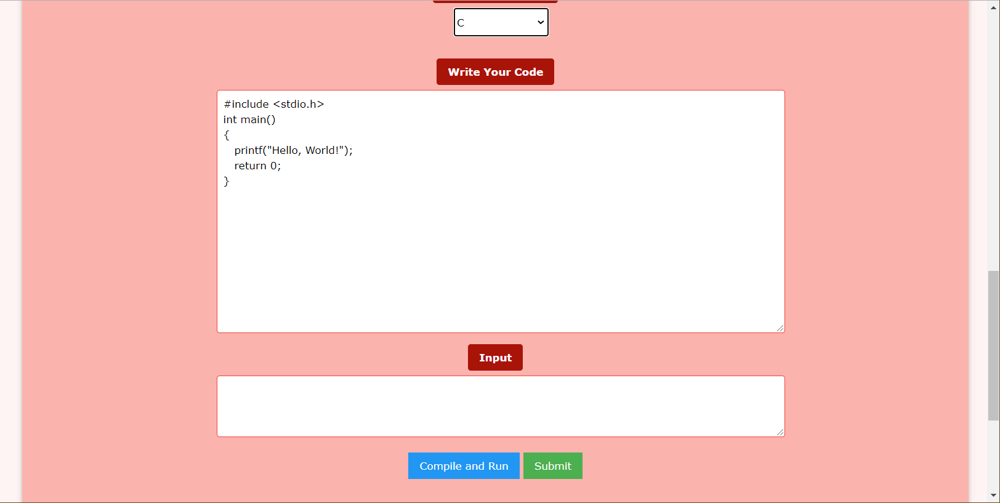
 
 
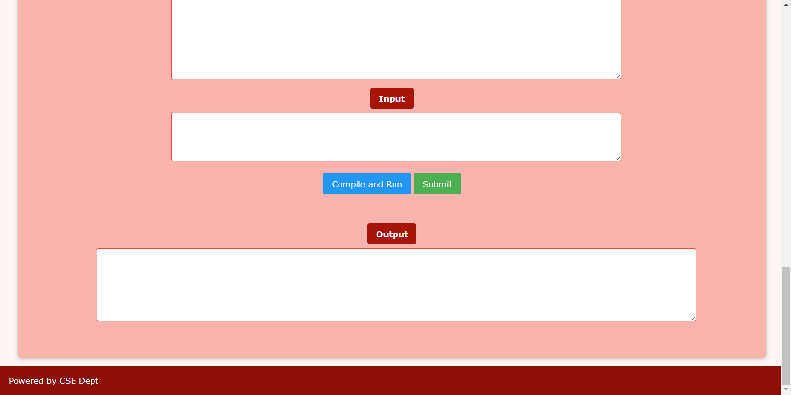
 
 
<b>7. Result Page</b> 

 
 
<b>8. Administrator Panel for Setting questions via MS-Excel</b> 
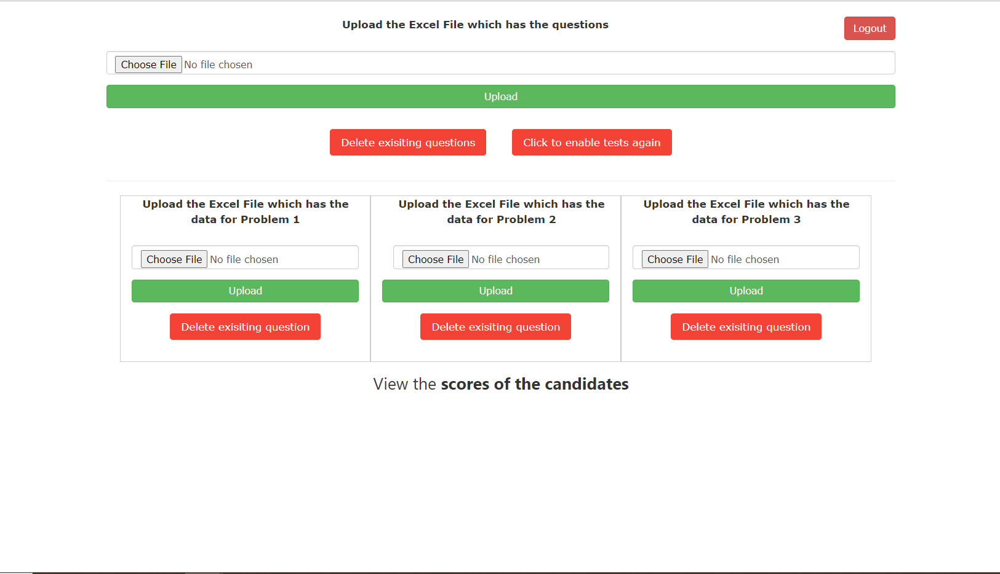
 
 
<b>9. Culminative Score Preview and Download page</b> 

 
 
<b>10. MCQ Excel Format</b> 
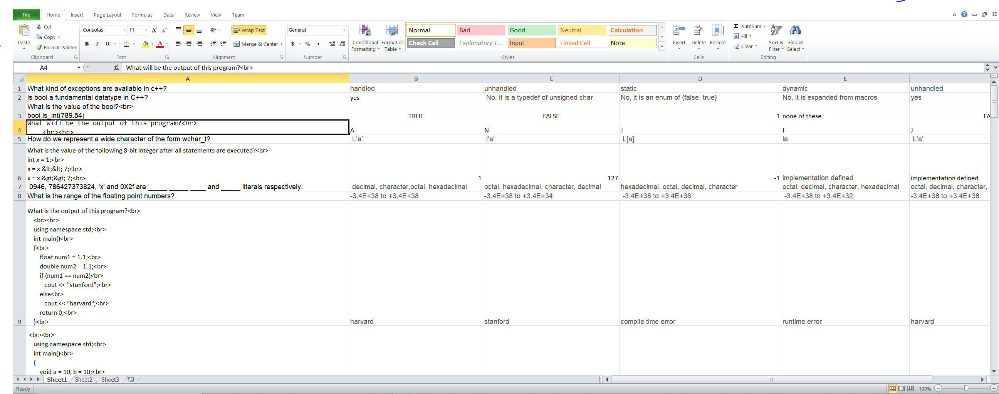
 
 
<b>11. Coding Question Excel Format</b>
 
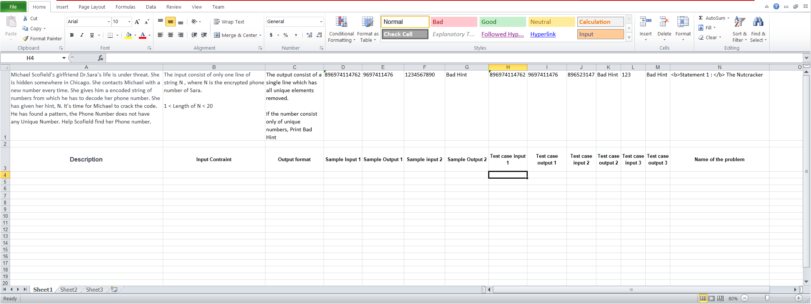
 
 
<b>Compiler Check</b>
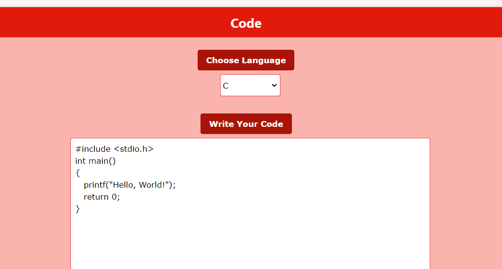
 
